### 🧭 Breadcrumbs
[Root](/) > [frontend](/frontend) > [src](/frontend/src)

# 📁 Src Directory
**Architecture Layer:** Domain/Infrastructure Layer

## 🎯 Purpose
Provides luxury professional architectural implementation for the src module within the Mavluda Beauty ecosystem. Ensure robust functionality and elegant integration with the broader architecture.

## 🏗️ ARCHITECTURE

```mermaid
graph TD
  f_Root_src["📁 src"]
  f_app_component_html["📄 app.component.html"]
  f_Root_src --> f_app_component_html
  f_app_component_scss["📄 app.component.scss"]
  f_Root_src --> f_app_component_scss
  f_app_component_ts["📄 app.component.ts"]
  f_Root_src --> f_app_component_ts
  f_app_routes_ts["📄 app.routes.ts"]
  f_Root_src --> f_app_routes_ts
  f_main_ts["📄 main.ts"]
  f_Root_src --> f_main_ts
  f_Dir_backend["📁 backend"]
  f_Root_src --> f_Dir_backend
  f_Dir_entities["📁 entities"]
  f_Root_src --> f_Dir_entities
  f_Dir_app["📁 app"]
  f_Root_src --> f_Dir_app
  f_Dir_locale["📁 locale"]
  f_Root_src --> f_Dir_locale
  f_Dir_core["📁 core"]
  f_Root_src --> f_Dir_core
  f_Dir_shared["📁 shared"]
  f_Root_src --> f_Dir_shared
  f_Dir_widgets["📁 widgets"]
  f_Root_src --> f_Dir_widgets
  f_Dir_pages["📁 pages"]
  f_Root_src --> f_Dir_pages
  f_Dir_features["📁 features"]
  f_Root_src --> f_Dir_features
  f_Dir_types["📁 types"]
  f_Root_src --> f_Dir_types
```


## 📄 FILE REGISTRY
| File Name | Type | Responsibility | Key Aliases Used |
|---|---|---|---|
| `app.component.html` | HTML Template | Structural template and layout for app.component.html. | N/A |
| `app.component.scss` | Stylesheet | Luxury styling and visual presentation for app.component.scss. | N/A |
| `app.component.ts` | TypeScript | UI component logic and state management for app.component.ts. | @angular/common, @angular/core, @shared/services, @angular/router, @shared/ui |
| `app.routes.ts` | TypeScript | Provides core logic and orchestration for app.routes.ts. | @angular/router, @core/guards |
| `main.ts` | TypeScript | Provides core logic and orchestration for main.ts. | @angular/platform-browser |

## 🔗 DEPENDENCIES
- `@angular/common`
- `@angular/core`
- `@angular/platform-browser`
- `@angular/router`
- `@core/guards`
- `@shared/services`
- `@shared/ui`

## 🛠️ USAGE
```typescript
// Example architectural integration for src
// Utilize the exported members according to Mavluda Beauty's standard conventions.
```

---
*Maintained by Mavluda Beauty - Architecture & Engineering*

---
*Maintained by Mavluda Beauty - Architecture & Engineering*