<!--
Mavluda Beauty - Luxury Professional Documentation
Generated for 100% Architectural Transparency
-->
[Home](../../README.md) > [frontend](../README.md) > [src](./README.md)

# 📁 SRC Directory

## 🎯 PURPOSE
Structures and provides the UI layers and interactive capabilities for the src feature in the Mavluda Beauty platform.

## 🏗️ ARCHITECTURE

```mermaid
graph TD
    Root["📁 src"]
    Root --> Sub_app["📁 app"]
    Root --> Sub_backend["📁 backend"]
    Root --> Sub_core["📁 core"]
    Root --> Sub_entities["📁 entities"]
    Root --> Sub_environments["📁 environments"]
    Root --> Sub_features["📁 features"]
    Root --> Sub_locale["📁 locale"]
    Root --> Sub_pages["📁 pages"]
    Root --> Sub_shared["📁 shared"]
    Root --> Sub_types["📁 types"]
    Root --> Sub_widgets["📁 widgets"]
    Root --> File_app_component_html["📄 app.component.html"]
    Root --> File_app_component_scss["📄 app.component.scss"]
    Root --> File_app_component_ts["📄 app.component.ts"]
    Root --> File_app_routes_ts["📄 app.routes.ts"]
```


## 📄 FILE REGISTRY
| File Name | Type | Responsibility | Key Aliases Used |
|---|---|---|---|
| `app.component.html` | HTML Template | UI rendering and component logic. | - |
| `app.component.scss` | Styles | UI rendering and component logic. | - |
| `app.component.ts` | TypeScript | UI rendering and component logic. | @angular, @shared |
| `app.routes.ts` | TypeScript | Core logic implementation. | @angular, @pages, @widgets |


## 🔗 DEPENDENCIES
- `@angular/router`
- `@angular/common`
- `@shared/services`
- `@shared/ui`
- `@pages/auth`
- `@widgets/layouts`

## 🛠️ USAGE
```typescript
// Example placeholder for interacting with src
// Consult the individual files in the registry for specific APIs.
```
