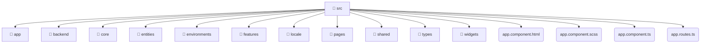

# [root](/) / [frontend](/frontend) / [src](/frontend/src)

## 🏷️ 📁 Src

### 🎯 PURPOSE
The `src` directory forms a critical foundation within the Mavluda Beauty ecosystem, meticulously orchestrating the src logic to ensure a seamless and premium experience.

### 🏗️ ARCHITECTURE


### 📄 FILE REGISTRY
| File Name | Type | Responsibility | Key Aliases Used |
|---|---|---|---|
| `app.component.html` | `html` | UI template and styling. | None |
| `app.component.scss` | `scss` | UI template and styling. | None |
| `app.component.ts` | `ts` | UI component logic and rendering. | @angular, @shared |
| `app.routes.ts` | `ts` | Core logic implementation. | @pages, @angular, @widgets |

### 🔗 DEPENDENCIES
- `@angular/common`
- `@angular/core`
- `@angular/router`
- `@pages/auth`
- `@shared/services`
- `@shared/ui`
- `@widgets/layouts`

### 🛠️ USAGE
```typescript
// Seamlessly integrate src into your refined workflows:
import { /* exported members */ } from '@path/to/src';
```
