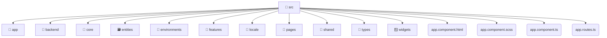

# [frontend](/frontend) / [src](/frontend/src)

## 🏷️ 📁 Src

### 🎯 PURPOSE
The `src` directory forms a critical foundation within the Mavluda Beauty ecosystem, meticulously orchestrating the src logic to ensure a seamless and premium experience. Integrated within our cutting-edge Angular frontend architecture, it crafts an elegant, highly-responsive user interface reflecting our luxury brand standards.

### 🏗️ ARCHITECTURE


### 📄 FILE REGISTRY
| File Name | Type | Responsibility | Key Aliases Used |
|---|---|---|---|
| `app.component.html` | `html` | Encapsulates premium logic and definitions for `app.component.html`. | None |
| `app.component.scss` | `scss` | Encapsulates premium logic and definitions for `app.component.scss`. | None |
| `app.component.ts` | `ts` | Encapsulates premium logic and definitions for `app.component.ts`. | @shared/ui, @angular/common, @angular/core, @angular/router, @shared/services |
| `app.routes.ts` | `ts` | Encapsulates premium logic and definitions for `app.routes.ts`. | @angular/router, @widgets/layouts, @pages/auth |


### 🔗 DEPENDENCIES
- `@angular/common`
- `@angular/core`
- `@angular/router`
- `@pages/auth`
- `@shared/services`
- `@shared/ui`
- `@widgets/layouts`

### 🛠️ USAGE
```typescript
// Seamlessly integrate src into your refined workflows:
import { /* exported members */ } from '@path/to/src';
```
