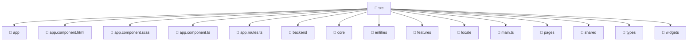

# 📁 src

[Root](/.) > [frontend](/frontend) > [src](/frontend/src)

## 🎯 Purpose
Delivering luxury-tier architectural components and high-performance logic for the **src** domain. This directory is a crucial part of the Mavluda Beauty full-stack ecosystem, ensuring seamless scalability, robust performance, and an elite digital experience.

## 🏗️ Architecture


## 📄 File Registry
| File Name | Type | Responsibility | Key Aliases Used |
|---|---|---|---|
| `app.component.html` | HTML | Handles logic and definitions for app.component.html | None |
| `app.component.scss` | SCSS | Handles logic and definitions for app.component.scss | None |
| `app.component.ts` | TypeScript | Handles logic and definitions for app.component.ts | @angular/common, @angular/router, @shared/services, @shared/ui |
| `app.routes.ts` | TypeScript | Handles logic and definitions for app.routes.ts | @angular/router |
| `main.ts` | TypeScript | Handles logic and definitions for main.ts | @angular/platform-browser |

## 🔗 Dependencies
- `./app.component`
- `./app/app.config`
- `@angular/common`
- `@angular/platform-browser`
- `@angular/router`
- `@shared/services`
- `@shared/ui`

## 🛠️ Usage
```typescript
// Example usage within the Mavluda Beauty ecosystem
import { relevantMember } from './src';

// Integrate into the application architecture
relevantMember.execute();
```
