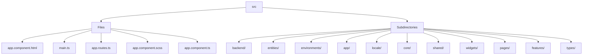

# 🏷️ Src Directory

> *Elegance, Precision, and Luxury Professionalism — The Mavluda Beauty Standard.*

## 🧭 Breadcrumb Navigation
[frontend](/frontend) ➔ [src](/frontend/src)

## 🎯 Purpose
This directory encapsulates the essential architecture and logic for the **Src** domain within the Mavluda Beauty ecosystem. It serves as a foundational component ensuring robust, scalable, and elegant operations.

## 🏗️ Architecture


## 📄 File Registry
| File Name | Type | Responsibility | Key Aliases Used |
|---|---|---|---|
| `app.component.html` | HTML Template | Defines logic and structure for app.component.html. | @app |
| `main.ts` | TypeScript | Defines logic and structure for main.ts. | None |
| `app.routes.ts` | TypeScript | Exports: routes | @widgets, @pages |
| `app.component.scss` | Stylesheet | Defines logic and structure for app.component.scss. | None |
| `app.component.ts` | TypeScript | Exports: AppComponent | @shared |

## 🔗 Dependencies
- `@angular/common`
- `@angular/core`
- `@angular/platform-browser`
- `@angular/router`
- `@pages/auth`
- `@shared/services`
- `@shared/ui`
- `@widgets/layouts`

## 🛠️ Usage
```typescript
// To utilize the luxurious capabilities of this module:
import { routes } from './path/to/routes';

// Ensure properly typed interactions per Mavluda Beauty standards
```
