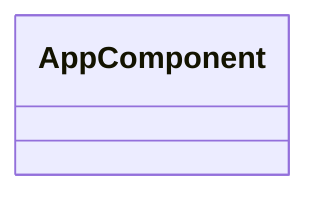

# 📁 Src Directory

[Root](/.) / [frontend](/frontend) / [src](/frontend/src)

## 🎯 Purpose
Delivering luxury-tier architectural components and high-performance logic for the **src** domain. This directory is a crucial part of the Mavluda Beauty full-stack ecosystem, ensuring seamless scalability, robust performance, and an elite digital experience.

## 🏗️ Architecture


## 📄 File Registry
| File Name | Type | Responsibility | Key Aliases Used |
|---|---|---|---|
| `app` | Directory | Contains architectural sub-modules and layer logic for app. | N/A |
| `app.component.html` | File | Structural template and layout for app.component.html. | N/A |
| `app.component.scss` | File | Luxury styling and visual presentation for app.component.scss. | N/A |
| `app.component.ts` | File | UI component logic and state management for app.component.ts. | @shared/services, @angular/core, @angular/router, @shared/ui, @angular/common |
| `app.routes.ts` | File | Provides core logic and orchestration for app.routes.ts. | @core/guards, @angular/router |
| `backend` | Directory | Contains architectural sub-modules and layer logic for backend. | N/A |
| `core` | Directory | Contains architectural sub-modules and layer logic for core. | N/A |
| `entities` | Directory | Contains architectural sub-modules and layer logic for entities. | N/A |
| `features` | Directory | Contains architectural sub-modules and layer logic for features. | N/A |
| `locale` | Directory | Contains architectural sub-modules and layer logic for locale. | N/A |
| `main.ts` | File | Provides core logic and orchestration for main.ts. | @angular/platform-browser |
| `pages` | Directory | Contains architectural sub-modules and layer logic for pages. | N/A |
| `shared` | Directory | Contains architectural sub-modules and layer logic for shared. | N/A |
| `types` | Directory | Contains architectural sub-modules and layer logic for types. | N/A |
| `widgets` | Directory | Contains architectural sub-modules and layer logic for widgets. | N/A |

## 🔗 Dependencies
- Relies on internal Mavluda Beauty architecture and designated FSD layers.
- See 'Key Aliases Used' in the File Registry for explicit cross-domain references.

## 🛠️ Usage
```typescript
// Example usage within the Mavluda Beauty ecosystem
import { relevantMember } from './core';

// Integrate into the application architecture
relevantMember.execute();
```
