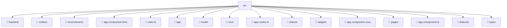

# 📂 SRC

> 💎 **Mavluda Beauty - Luxury Professional Architecture**

### 📍 Breadcrumb Navigation
`. > frontend > src`

## 🎯 PURPOSE
This directory encapsulates `General` level functionality within the Mavluda Beauty ecosystem, ensuring proper separation of concerns and architectural transparency.

**FSD / Architecture Layer:** `General`

## 🏗️ ARCHITECTURE


## 📄 FILE REGISTRY

| Item Name | Type | Responsibility | Key Aliases Used |
|-----------|------|----------------|------------------|
| `📁 backend` | `Directory` | Subdirectory logic grouping | `None` |
| `📁 entities` | `Directory` | Subdirectory logic grouping | `None` |
| `📁 environments` | `Directory` | Subdirectory logic grouping | `None` |
| `📄 app.component.html` | `.html` | Component logic | `None` |
| `📄 main.ts` | `.ts` | General functionality | `@angular/platform-browser` |
| `📁 app` | `Directory` | Subdirectory logic grouping | `None` |
| `📁 locale` | `Directory` | Subdirectory logic grouping | `None` |
| `📁 core` | `Directory` | Subdirectory logic grouping | `None` |
| `📄 app.routes.ts` | `.ts` | General functionality | `@pages/auth, @angular/router, @widgets/layouts` |
| `📁 shared` | `Directory` | Subdirectory logic grouping | `None` |
| `📁 widgets` | `Directory` | Subdirectory logic grouping | `None` |
| `📄 app.component.scss` | `.scss` | Component logic | `None` |
| `📁 pages` | `Directory` | Subdirectory logic grouping | `None` |
| `📄 app.component.ts` | `.ts` | Component logic | `@angular/core, @angular/common, @angular/router, @shared/ui, @shared/services` |
| `📁 features` | `Directory` | Subdirectory logic grouping | `None` |
| `📁 types` | `Directory` | Subdirectory logic grouping | `None` |

## 🔗 DEPENDENCIES
- `@angular/platform-browser`
- `@widgets/layouts`
- `@angular/core`
- `@angular/common`
- `@angular/router`
- `@pages/auth`
- `@shared/ui`
- `@shared/services`

## 🛠️ USAGE
```typescript
// Example usage context
import { ... } from './main';

// Integrate main logic into your feature.
```
