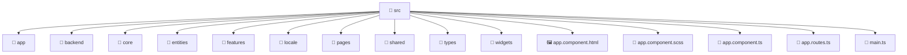

# 📁 src

[Root](/../../README.md) / [frontend](../README.md) / [src](./README.md)

## 🎯 Purpose
Delivering luxury-tier architectural components and high-performance logic for the **src** domain. This directory is a crucial part of the Mavluda Beauty full-stack ecosystem, ensuring seamless scalability, robust performance, and an elite digital experience.

## 🏗️ Architecture


## 📄 File Registry
| File Name | Type | Responsibility | Key Aliases Used |
|---|---|---|---|
| `app.component.html` | Template | Structural template and layout for app.component.html. | N/A |
| `app.component.scss` | Stylesheet | Luxury styling and visual presentation for app.component.scss. | N/A |
| `app.component.ts` | Component | UI component logic and state management for app.component.ts. | @angular, @shared |
| `app.routes.ts` | TypeScript | Provides core logic and orchestration for app.routes.ts. | @angular |
| `main.ts` | TypeScript | Provides core logic and orchestration for main.ts. | @angular |


## 🔗 Dependencies
**Internal / Aliases:**
- `./app.component`
- `./app/app.config`
- `@angular/common`
- `@angular/platform-browser`
- `@angular/router`
- `@shared/services`
- `@shared/ui`


## 🛠️ Usage
```typescript
// Example usage within the Mavluda Beauty ecosystem
import { relevantMember } from './app.component';

// Integrate into the application architecture
relevantMember.execute();
```
