# 📁 src

[Root](/.) > [frontend](/frontend) > [src](/frontend/src)

## 🎯 Purpose
Delivering luxury-tier architectural components and high-performance logic for the **src** domain. This directory is a crucial part of the Mavluda Beauty full-stack ecosystem, ensuring seamless scalability, robust performance, and an elite digital experience.

## 🏗️ Architecture

```mermaid
graph TD
  src["📁 src"]
  src --> backend["📁 backend"]
  src --> entities["📁 entities"]
  src --> environments["📁 environments"]
  src --> app["📁 app"]
  src --> locale["📁 locale"]
  src --> core["📁 core"]
  src --> shared["📁 shared"]
  src --> widgets["📁 widgets"]
  src --> pages["📁 pages"]
  src --> features["📁 features"]
  src --> types["📁 types"]
  src --> app_component_html["📄 app.component.html"]
  src --> main_ts["📄 main.ts"]
  src --> app_routes_ts["📄 app.routes.ts"]
  src --> app_component_scss["📄 app.component.scss"]
  src --> app_component_ts["📄 app.component.ts"]
```


## 📄 File Registry
| File Name | Type | Responsibility | Key Aliases Used |
|---|---|---|---|
| `app.component.html` | Template | Structural template and layout for app.component.html. | N/A |
| `app.component.scss` | Style | Luxury styling and visual presentation for app.component.scss. | N/A |
| `app.component.ts` | TypeScript | UI component logic and state management for app.component.ts. | @shared, @angular |
| `app.routes.ts` | TypeScript | Provides core logic and orchestration for app.routes.ts. | @angular, @pages, @widgets |
| `main.ts` | TypeScript | Provides core logic and orchestration for main.ts. | @angular |

## 🔗 Dependencies
- `@angular/common`
- `@angular/core`
- `@angular/platform-browser`
- `@angular/router`
- `@pages/auth`
- `@shared/services`
- `@shared/ui`
- `@widgets/layouts`

## 🛠️ Usage
```typescript
// Example usage within the Mavluda Beauty ecosystem
import { relevantMember } from './core';

// Integrate into the application architecture
relevantMember.execute();
```
