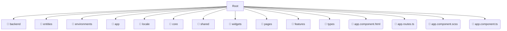

# 💻 src

*Breadcrumbs:* [frontend](/frontend) / [src](/frontend/src)

## 🎯 PURPOSE
This directory `src` is an integral part of the Mavluda Beauty ecosystem. It contributes to the Angular zoneless, signal-based frontend.
This directory is meticulously maintained to uphold the 'Luxury Professional' standards of the Mavluda Beauty brand.

## 🏗️ ARCHITECTURE


## 📄 FILE REGISTRY
| File Name | Type | Responsibility | Key Aliases Used |
|---|---|---|---|
| `app.component.html` | `html` | UI Template | `None` |
| `app.routes.ts` | `ts` | Core functionality | `@angular/router, @widgets/layouts, @pages/auth` |
| `app.component.scss` | `scss` | Styling | `None` |
| `app.component.ts` | `ts` | UI Component logic | `@angular/router, @shared/ui, @angular/common...` |

## 🔗 DEPENDENCIES
- `@angular/router`
- `@pages/auth`
- `@shared/ui`
- `@angular/common`
- `@angular/core`
- `@shared/services`
- `@widgets/layouts`

## 🛠️ USAGE
```typescript
// Example placeholder for interacting with the src module
import { example } from './app.component.html';
```
