# 💻 Src

[Root](../../) > [frontend](../) > [src](./)

## 🎯 Purpose
Delivering luxury-tier architectural components and high-performance logic for the **Src** domain. This directory is a crucial part of the Mavluda Beauty full-stack ecosystem, ensuring seamless scalability, robust performance, and an elite digital experience.

## 🏗️ Architecture

```mermaid
graph TD
  src["💻 src"]
  src --> app["📁 app"]
  src --> backend["📁 backend"]
  src --> core["📁 core"]
  src --> entities["📁 entities"]
  src --> environments["📁 environments"]
  src --> features["📁 features"]
  src --> locale["📁 locale"]
  src --> pages["📁 pages"]
  src --> shared["📁 shared"]
  src --> types["📁 types"]
  src --> widgets["📁 widgets"]
  src --> app_component_html["📄 app.component.html"]
  src --> app_component_scss["📄 app.component.scss"]
  src --> app_component_ts["📄 app.component.ts"]
  src --> app_routes_ts["📄 app.routes.ts"]
  src --> main_ts["📄 main.ts"]
```


## 📄 File Registry
| File Name | Type | Responsibility | Key Aliases Used |
|---|---|---|---|
| `app.component.html` | HTML Template | Core logic and utilities for this domain. | N/A |
| `app.component.scss` | SCSS Stylesheet | Core logic and utilities for this domain. | N/A |
| `app.component.ts` | TypeScript | Core logic and utilities for this domain. | @angular/core, @shared/ui, @shared/services, @angular/common, @angular/router |
| `app.routes.ts` | TypeScript | Core logic and utilities for this domain. | @pages/auth, @angular/router, @widgets/layouts |
| `main.ts` | TypeScript | Core logic and utilities for this domain. | @angular/platform-browser |


## 🔗 Dependencies
- `@angular/common`
- `@angular/core`
- `@angular/platform-browser`
- `@angular/router`
- `@pages/auth`
- `@shared/services`
- `@shared/ui`
- `@widgets/layouts`

## 🛠️ Usage
```markdown
> This directory acts primarily as a structural container or logic module.
> To interact with its contents, import the relevant exported members from the `index.ts` or specifically targeted files.
```
