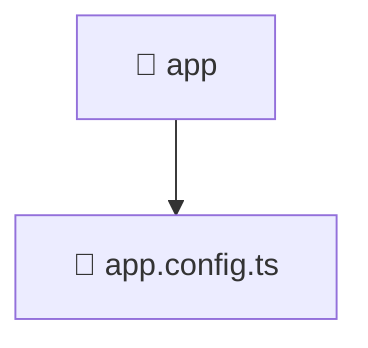

<!--
Mavluda Beauty - Luxury Professional Documentation
Generated for 100% Architectural Transparency
-->
[Home](../../../README.md) > [frontend](../../README.md) > [src](../README.md) > [app](./README.md)

# 📁 APP Directory

> **FSD Layer:** App

## 🎯 PURPOSE
Initializes the application, global styles, providers, and root routing.

## 🏗️ ARCHITECTURE


## 📄 FILE REGISTRY
| File Name | Type | Responsibility | Key Aliases Used |
|---|---|---|---|
| `app.config.ts` | TypeScript | Core logic implementation. | @angular, @src, @core |


## 🔗 DEPENDENCIES
- `@angular/platform-browser/animations`
- `@angular/router`
- `@src/app.routes`
- `@core/interceptors`

## 🛠️ USAGE
```typescript
// Example placeholder for interacting with app
// Consult the individual files in the registry for specific APIs.
```
