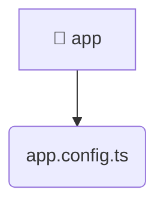

# [root](/) / [frontend](/frontend) / [src](/frontend/src) / [app](/frontend/src/app)

## 🏷️ 📁 App

### 🎯 PURPOSE
The `app` directory forms a critical foundation within the Mavluda Beauty ecosystem, meticulously orchestrating the app logic to ensure a seamless and premium experience.

This directory resides within the **App** layer of our Feature Sliced Design (FSD) architecture, strictly adhering to Mavluda Beauty's robust separation of concerns.

### 🏗️ ARCHITECTURE


### 📄 FILE REGISTRY
| File Name | Type | Responsibility | Key Aliases Used |
|---|---|---|---|
| `app.config.ts` | `ts` | Core logic implementation. | @src, @angular, @core |

### 🔗 DEPENDENCIES
- `@angular/common/http`
- `@angular/core`
- `@angular/platform-browser/animations`
- `@angular/router`
- `@core/interceptors`
- `@src/app.routes`

### 🛠️ USAGE
```typescript
// Seamlessly integrate app into your refined workflows:
import { /* exported members */ } from '@path/to/app';
```
