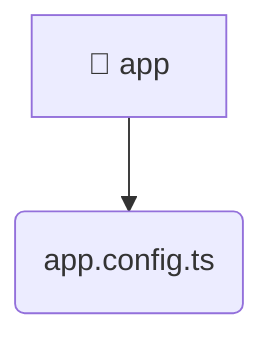

# [frontend](/frontend) / [src](/frontend/src) / [app](/frontend/src/app)

## 🏷️ 📁 App

### 🎯 PURPOSE
The `app` directory forms a critical foundation within the Mavluda Beauty ecosystem, meticulously orchestrating the app logic to ensure a seamless and premium experience. Integrated within our cutting-edge Angular frontend architecture, it crafts an elegant, highly-responsive user interface reflecting our luxury brand standards. This module is a distinguished component of the **App** layer under the Feature Sliced Design (FSD) methodology.

### 🏗️ ARCHITECTURE


### 📄 FILE REGISTRY
| File Name | Type | Responsibility | Key Aliases Used |
|---|---|---|---|
| `app.config.ts` | `ts` | Encapsulates premium logic and definitions for `app.config.ts`. | @angular/core, @angular/common/http, @angular/router, @angular/platform-browser/animations, @core/interceptors, @src/app.routes |


### 🔗 DEPENDENCIES
- `@angular/common/http`
- `@angular/core`
- `@angular/platform-browser/animations`
- `@angular/router`
- `@core/interceptors`
- `@src/app.routes`

### 🛠️ USAGE
```typescript
// Seamlessly integrate app into your refined workflows:
import { /* exported members */ } from '@path/to/app';
```
