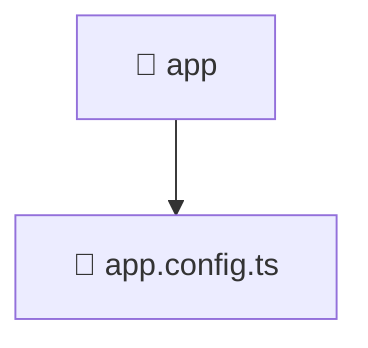

# 📁 app

[Root](/.) > [frontend](/frontend) > [src](/frontend/src) > [app](/frontend/src/app)

## 🎯 Purpose
Delivering luxury-tier architectural components and high-performance logic for the **app** domain. This directory is a crucial part of the Mavluda Beauty full-stack ecosystem, ensuring seamless scalability, robust performance, and an elite digital experience.

## 🏗️ Architecture


## 📄 File Registry
| File Name | Type | Responsibility | Key Aliases Used |
|---|---|---|---|
| `app.config.ts` | TypeScript | Handles logic and definitions for app.config.ts | @angular/platform-browser/animations, @angular/router, @core/interceptors, @src/app.routes |

## 🔗 Dependencies
- `@angular/platform-browser/animations`
- `@angular/router`
- `@core/interceptors`
- `@src/app.routes`

## 🛠️ Usage
```typescript
// Example usage within the Mavluda Beauty ecosystem
import { relevantMember } from './app';

// Integrate into the application architecture
relevantMember.execute();
```
