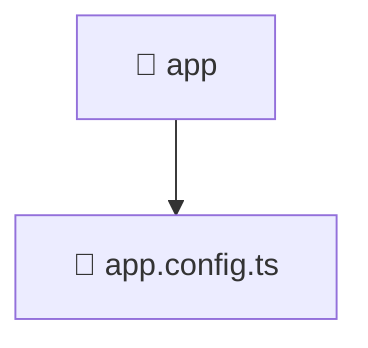

### 🧭 Breadcrumbs
[Root](/) > [frontend](/frontend) > [src](/frontend/src) > [app](/frontend/src/app)

# 📁 App Directory
**Architecture Layer:** Domain/Infrastructure Layer

## 🎯 Purpose
Provides luxury professional architectural implementation for the app module within the Mavluda Beauty ecosystem. Ensure robust functionality and elegant integration with the broader architecture.

## 🏗️ ARCHITECTURE


## 📄 FILE REGISTRY
| File Name | Type | Responsibility | Key Aliases Used |
|---|---|---|---|
| `app.config.ts` | TypeScript | Provides core logic and orchestration for app.config.ts. | @src/app.routes, @core/interceptors, @angular/core, @angular/router, @angular/platform-browser/animations, @angular/common/http |

## 🔗 DEPENDENCIES
- `@angular/common/http`
- `@angular/core`
- `@angular/platform-browser/animations`
- `@angular/router`
- `@core/interceptors`
- `@src/app.routes`

## 🛠️ USAGE
```typescript
// Example architectural integration for app
// Utilize the exported members according to Mavluda Beauty's standard conventions.
```

---
*Maintained by Mavluda Beauty - Architecture & Engineering*

---
*Maintained by Mavluda Beauty - Architecture & Engineering*