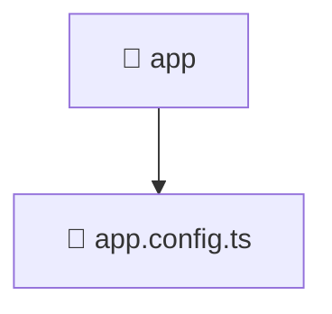

# 🚀 Mavluda Beauty app

[frontend](/frontend) / [src](/frontend/src) / [app](/frontend/src/app)

## 🎯 Purpose
Delivering luxury-tier architectural components and high-performance logic for the **app** domain. This directory is a crucial part of the Mavluda Beauty full-stack ecosystem, ensuring seamless scalability, robust performance, and an elite digital experience.

> **FSD Layer**: `App` - Adhering to Feature Sliced Design principles.

## 🏗️ Architecture


## 📄 File Registry
| File Name | Type | Responsibility | Key Aliases Used |
|---|---|---|---|
| `app.config.ts` | TypeScript Logic | Core logic and utilities for this domain. | `@angular/core, @angular/platform-browser/animations, @angular/router, @src/app.routes, @angular/common/http, @core/interceptors` |


## 🔗 Dependencies
**Path Aliases:**
- `@angular/core`
- `@angular/platform-browser/animations`
- `@angular/router`
- `@src/app.routes`
- `@angular/common/http`
- `@core/interceptors`


## 🛠️ Usage
```typescript
// Example integration for app
// Import capabilities from this directory to enrich your modules.
```
> This directory provides specialized logic tailored to the Mavluda Beauty standard.
