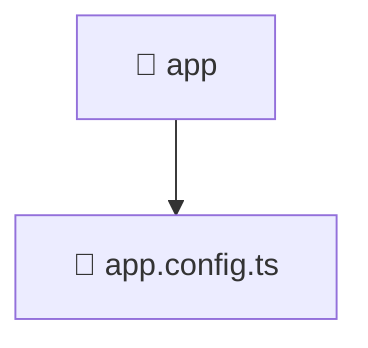

# 🚀 app

[Root](/.) > [frontend](/frontend) > [src](/frontend/src) > [app](/frontend/src/app)

## 🎯 Purpose
Delivering luxury-tier architectural components and high-performance logic for the **app** domain. This directory is a crucial part of the Mavluda Beauty full-stack ecosystem, ensuring seamless scalability, robust performance, and an elite digital experience.
> **FSD Layer:** App - Adhering to strict Feature Sliced Design architectural constraints.

## 🏗️ Architecture


## 📄 File Registry
| File Name | Type | Responsibility | Key Aliases Used |
|---|---|---|---|
| `app.config.ts` | File | Core logic and utilities for this domain. | @angular, @src, @core |


## 🔗 Dependencies
- `@angular/core`
- `@angular/platform-browser/animations`
- `@angular/router`
- `@src/app.routes`
- `@angular/common/http`
- `@core/interceptors`

## 🛠️ Usage
```typescript
// Example usage within the Mavluda Beauty ecosystem
import { relevantMember } from './app.config';

// Integrate into the application architecture
relevantMember.execute();
```
