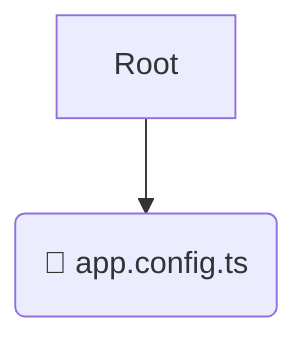

# 🚀 app

*Breadcrumbs:* [frontend](/frontend) / [src](/frontend/src) / [app](/frontend/src/app)

## 🎯 PURPOSE
This directory `app` is an integral part of the Mavluda Beauty ecosystem. It contributes to the Angular zoneless, signal-based frontend.
This directory is meticulously maintained to uphold the 'Luxury Professional' standards of the Mavluda Beauty brand.

## 🏗️ ARCHITECTURE


## 📄 FILE REGISTRY
| File Name | Type | Responsibility | Key Aliases Used |
|---|---|---|---|
| `app.config.ts` | `ts` | Core functionality | `@angular/router, @angular/common/http, @angular/platform-browser/animations...` |

## 🔗 DEPENDENCIES
- `@angular/router`
- `@angular/common/http`
- `@angular/platform-browser/animations`
- `@angular/core`
- `@src/app.routes`
- `@core/interceptors`

## 🛠️ USAGE
```typescript
// Example placeholder for interacting with the app module
import { example } from './app.config.ts';
```
