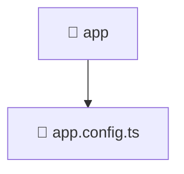

# 📱 app

[Root](/../../../README.md) / [frontend](../../README.md) / [src](../README.md) / [app](./README.md)

## 🎯 Purpose
Delivering luxury-tier architectural components and high-performance logic for the **app** domain. This directory is a crucial part of the Mavluda Beauty full-stack ecosystem, ensuring seamless scalability, robust performance, and an elite digital experience.

**FSD Layer:** App

## 🏗️ Architecture


## 📄 File Registry
| File Name | Type | Responsibility | Key Aliases Used |
|---|---|---|---|
| `app.config.ts` | TypeScript | Provides core logic and orchestration for app.config.ts. | @angular, @core, @src |


## 🔗 Dependencies
**Internal / Aliases:**
- `@angular/platform-browser/animations`
- `@angular/router`
- `@core/interceptors`
- `@src/app.routes`


## 🛠️ Usage
```typescript
// Example usage within the Mavluda Beauty ecosystem
import { relevantMember } from './app.config';

// Integrate into the application architecture
relevantMember.execute();
```
