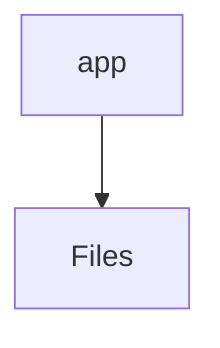

# 📁 App Directory

[frontend](/frontend) > [src](/frontend/src) > [app](/frontend/src/app)

## 🎯 Purpose
A high-level module handling `app` logic within the Mavluda Beauty ecosystem. This directory adheres to our "Luxury Professional" architectural standards.

**FSD Layer:** App


## 🏗️ Architecture



## 📄 File Registry
| File Name | Type | Responsibility | Key Aliases Used |
|-----------|------|----------------|------------------|
| `app.config.ts` | TypeScript | Provides localized typescript definitions. | @angular/core, @angular/router, @src/app.routes, @core/interceptors, @angular/common/http, @angular/platform-browser/animations |

## 🔗 Dependencies
- `@angular/common/http`
- `@angular/core`
- `@angular/platform-browser/animations`
- `@angular/router`
- `@core/interceptors`
- `@src/app.routes`

## 🛠️ Usage
```typescript
// Architectural overview snippet
import { InternalLogic } from './internal-file';
// Ensure adherence to Hexagonal / FSD principles
```
