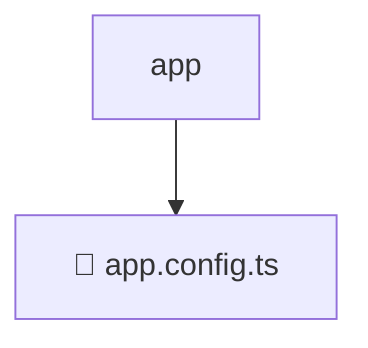

# 📂 APP

> 💎 **Mavluda Beauty - Luxury Professional Architecture**

### 📍 Breadcrumb Navigation
`. > frontend > src > app`

## 🎯 PURPOSE
This directory encapsulates `App` level functionality within the Mavluda Beauty ecosystem, ensuring proper separation of concerns and architectural transparency.

**FSD / Architecture Layer:** `App`

## 🏗️ ARCHITECTURE


## 📄 FILE REGISTRY

| Item Name | Type | Responsibility | Key Aliases Used |
|-----------|------|----------------|------------------|
| `📄 app.config.ts` | `.ts` | General functionality | `@src/app.routes, @angular/core, @core/interceptors, @angular/router, @angular/platform-browser/animations, @angular/common/http` |

## 🔗 DEPENDENCIES
- `@src/app.routes`
- `@angular/core`
- `@core/interceptors`
- `@angular/router`
- `@angular/platform-browser/animations`
- `@angular/common/http`

## 🛠️ USAGE
```typescript
// Example usage context
import { ... } from './app.config';

// Integrate app.config logic into your feature.
```
