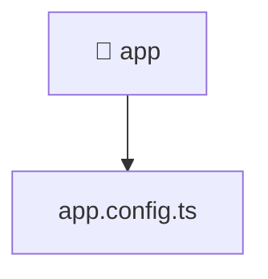

[🏠 Home](../../../README.md) > [frontend](../../README.md) > [src](../README.md) > [app](./README.md)

# 🚀 app

**FSD Layer:** `App`

### 🎯 PURPOSE
Welcome to the exquisite **app** module of the Mavluda Beauty ecosystem. This directory handles specific domain assets and logic. It is designed adhering to our 'Luxury Professional' standards.

### 🏗️ ARCHITECTURE


### 📄 FILE REGISTRY
| File Name | Type | Responsibility | Key Aliases Used |
|---|---|---|---|
| `app.config.ts` | TypeScript File | Provides logic and definitions for app.config.ts. | @src, @angular, @core |

### 🔗 DEPENDENCIES
- `@angular/platform-browser/animations`
- `@angular/router`
- `@core/interceptors`
- `@src/app.routes`

### 🛠️ USAGE
```typescript
// Example interaction or integration snippet
// Import members from app based on module boundaries
```
