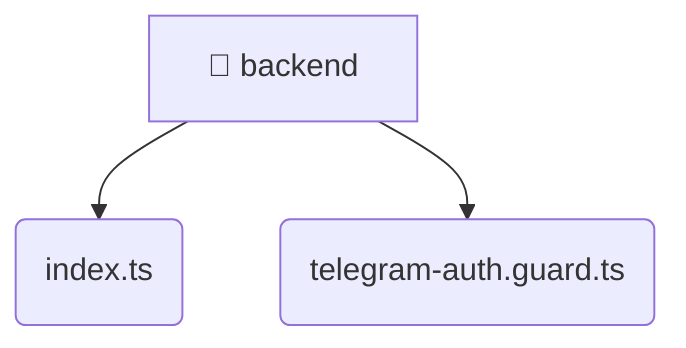

# [frontend](/frontend) / [src](/frontend/src) / [backend](/frontend/src/backend)

## 🏷️ 📁 Backend

### 🎯 PURPOSE
The `backend` directory forms a critical foundation within the Mavluda Beauty ecosystem, meticulously orchestrating the backend logic to ensure a seamless and premium experience. Rooted in the NestJS backend architecture, it delivers robust, high-performance operations tailored for high-end beauty and wedding services.

### 🏗️ ARCHITECTURE


### 📄 FILE REGISTRY
| File Name | Type | Responsibility | Key Aliases Used |
|---|---|---|---|
| `index.ts` | `ts` | Encapsulates premium logic and definitions for `index.ts`. | None |
| `telegram-auth.guard.ts` | `ts` | Encapsulates premium logic and definitions for `telegram-auth.guard.ts`. | @nestjs/common |


### 🔗 DEPENDENCIES
- `@nestjs/common`

### 🛠️ USAGE
```typescript
// Seamlessly integrate backend into your refined workflows:
import { /* exported members */ } from '@path/to/backend';
```
