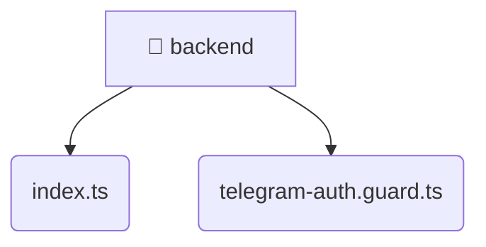

# [root](/) / [frontend](/frontend) / [src](/frontend/src) / [backend](/frontend/src/backend)

## 🏷️ 📁 Backend

### 🎯 PURPOSE
The root directory contains the full-stack Mavluda Beauty application, divided into frontend and backend.

### 🏗️ ARCHITECTURE


### 📄 FILE REGISTRY
| File Name | Type | Responsibility | Key Aliases Used |
|---|---|---|---|
| `index.ts` | `ts` | Core logic implementation. | None |
| `telegram-auth.guard.ts` | `ts` | Core logic implementation. | @nestjs |

### 🔗 DEPENDENCIES
- `./telegram-auth.guard`
- `@nestjs/common`
- `crypto`
- `express`

### 🛠️ USAGE
```typescript
// Seamlessly integrate backend into your refined workflows:
import { /* exported members */ } from '@path/to/backend';
```
