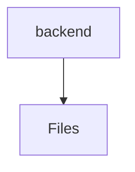

# ⚙️ Backend Directory

[frontend](/frontend) > [src](/frontend/src) > [backend](/frontend/src/backend)

## 🎯 Purpose
A high-level module handling `backend` logic within the Mavluda Beauty ecosystem. This directory adheres to our "Luxury Professional" architectural standards.


## 🏗️ Architecture



## 📄 File Registry
| File Name | Type | Responsibility | Key Aliases Used |
|-----------|------|----------------|------------------|
| `index.ts` | TypeScript | Provides localized typescript definitions. | None |
| `telegram-auth.guard.ts` | TypeScript | Handles authentication/authorization protection. | @nestjs/common |

## 🔗 Dependencies
- `@nestjs/common`

## 🛠️ Usage
```typescript
// Architectural overview snippet
import { InternalLogic } from './internal-file';
// Ensure adherence to Hexagonal / FSD principles
```

## 📝 Existing Context
# 📁 backend

[Root](/.) > [frontend](/frontend) > [src](/frontend/src) > [backend](/frontend/src/backend)

## 🎯 Purpose
Delivering luxury-tier architectural components and high-performance logic for the **backend** domain. This directory is a crucial part of the Mavluda Beauty full-stack ecosystem, ensuring seamless scalability, robust performance, and an elite digital experience.

## 🏗️ Architecture


## 📄 File Registry
| File Name | Type | Responsibility | Key Aliases Used |
|---|---|---|---|
| `index.ts` | TypeScript | Provides core logic and orchestration for index.ts. | N/A |
| `telegram-auth.guard.ts` | TypeScript | Provides core logic and orchestration for telegram-auth.guard.ts. | @nestjs |

## 🔗 Dependencies
- `@nestjs/common`
- `crypto`
- `express`

## 🛠️ Usage
```typescript
// Example usage within the Mavluda Beauty ecosystem
import { relevantMember } from './backend';

// Integrate into the application architecture
relevantMember.execute();
```
