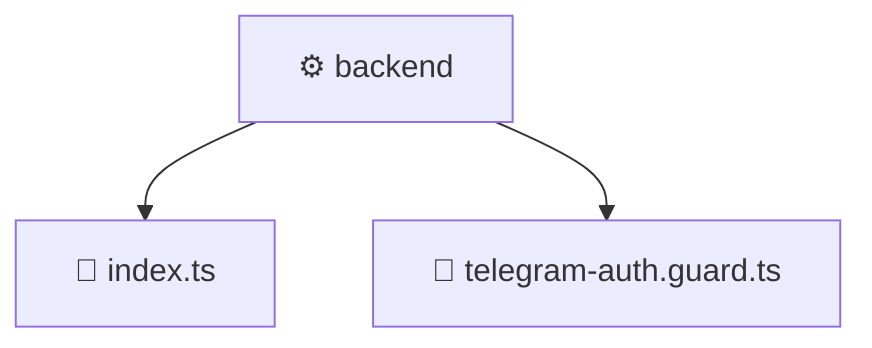

# ⚙️ backend

[Root](/../../../README.md) / [frontend](../../README.md) / [src](../README.md) / [backend](./README.md)

## 🎯 Purpose
Delivering luxury-tier architectural components and high-performance logic for the **backend** domain. This directory is a crucial part of the Mavluda Beauty full-stack ecosystem, ensuring seamless scalability, robust performance, and an elite digital experience.

## 🏗️ Architecture


## 📄 File Registry
| File Name | Type | Responsibility | Key Aliases Used |
|---|---|---|---|
| `index.ts` | TypeScript | Provides core logic and orchestration for index.ts. | N/A |
| `telegram-auth.guard.ts` | Guard | Provides core logic and orchestration for telegram-auth.guard.ts. | @nestjs |


## 🔗 Dependencies
**Internal / Aliases:**
- `@nestjs/common`

**External:**
- `crypto`
- `express`


## 🛠️ Usage
```typescript
// Example usage within the Mavluda Beauty ecosystem
import { relevantMember } from './index';

// Integrate into the application architecture
relevantMember.execute();
```
