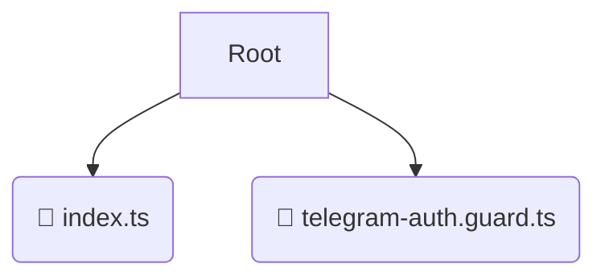

# ⚙️ backend

*Breadcrumbs:* [frontend](/frontend) / [src](/frontend/src) / [backend](/frontend/src/backend)

## 🎯 PURPOSE
This directory `backend` is an integral part of the Mavluda Beauty ecosystem. It supports the scalable NestJS backend architecture.
This directory is meticulously maintained to uphold the 'Luxury Professional' standards of the Mavluda Beauty brand.

## 🏗️ ARCHITECTURE


## 📄 FILE REGISTRY
| File Name | Type | Responsibility | Key Aliases Used |
|---|---|---|---|
| `index.ts` | `ts` | Core functionality | `None` |
| `telegram-auth.guard.ts` | `ts` | Core functionality | `@nestjs/common` |

## 🔗 DEPENDENCIES
- `@nestjs/common`

## 🛠️ USAGE
```typescript
// Example placeholder for interacting with the backend module
import { example } from './index.ts';
```
