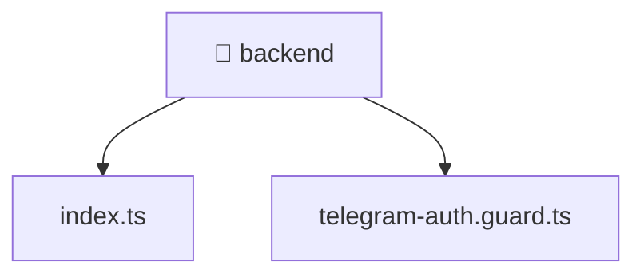

[🏠 Home](../../../README.md) > [frontend](../../README.md) > [src](../README.md) > [backend](./README.md)

# ⚙️ backend

### 🎯 PURPOSE
Welcome to the exquisite **backend** module of the Mavluda Beauty ecosystem. This directory handles specific domain assets and logic. It is designed adhering to our 'Luxury Professional' standards.

### 🏗️ ARCHITECTURE


### 📄 FILE REGISTRY
| File Name | Type | Responsibility | Key Aliases Used |
|---|---|---|---|
| `index.ts` | TypeScript File | Exports or orchestrates module members. | None |
| `telegram-auth.guard.ts` | TypeScript File | Provides injectable business logic or services Defines classes: TelegramAuthGuard. | @nestjs |

### 🔗 DEPENDENCIES
- `@nestjs/common`
- `crypto`
- `express`

### 🛠️ USAGE
```typescript
// Example interaction or integration snippet
// Import members from backend based on module boundaries
```
