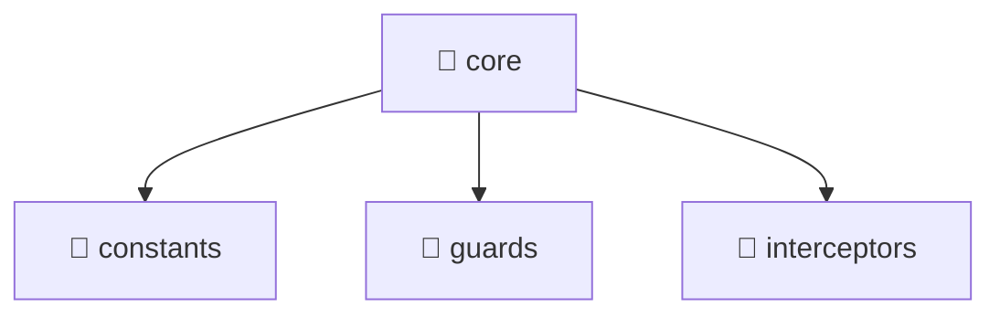

# 📁 Core Directory

[Root](/.) / [frontend](/frontend) / [src](/frontend/src) / [core](/frontend/src/core)

## 🎯 Purpose
Delivering luxury-tier architectural components and high-performance logic for the **core** domain. This directory is a crucial part of the Mavluda Beauty full-stack ecosystem, ensuring seamless scalability, robust performance, and an elite digital experience.

## 🏗️ Architecture


## 📄 File Registry
| File Name | Type | Responsibility | Key Aliases Used |
|---|---|---|---|
| `constants` | Directory | Contains architectural sub-modules and layer logic for constants. | N/A |
| `guards` | Directory | Contains architectural sub-modules and layer logic for guards. | N/A |
| `interceptors` | Directory | Contains architectural sub-modules and layer logic for interceptors. | N/A |

## 🔗 Dependencies
- Relies on internal Mavluda Beauty architecture and designated FSD layers.
- See 'Key Aliases Used' in the File Registry for explicit cross-domain references.

## 🛠️ Usage
```typescript
// Example usage within the Mavluda Beauty ecosystem
import { relevantMember } from './core';

// Integrate into the application architecture
relevantMember.execute();
```
