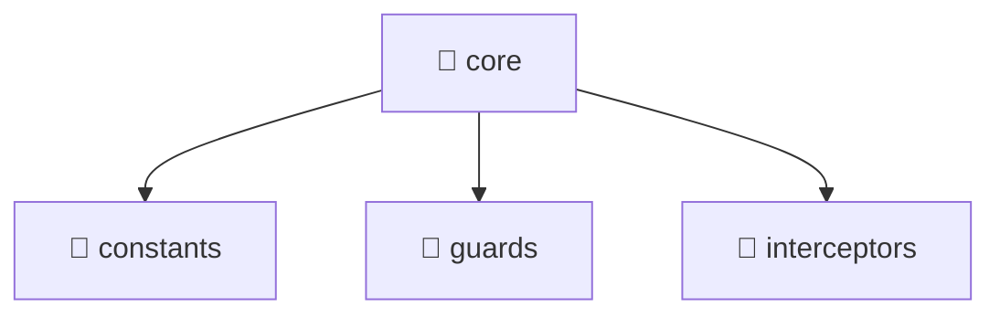

# 📁 core

[Root](/.) > [frontend](/frontend) > [src](/frontend/src) > [core](/frontend/src/core)

## 🎯 Purpose
Delivering luxury-tier architectural components and logic for the **core** domain. Ensuring seamless scalability, robust performance, and an elite digital experience in the Mavluda Beauty ecosystem.

## 🏗️ Architecture

## 📄 File Registry
| File Name | Type | Responsibility | Key Aliases Used |
|---|---|---|---|

## 🔗 Dependencies
- No external dependencies.

## 🛠️ Usage
> No specific code execution examples for this directory.
