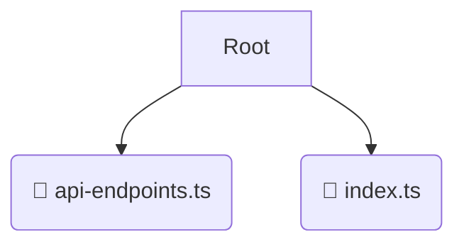

# 📂 constants

*Breadcrumbs:* [frontend](/frontend) / [src](/frontend/src) / [core](/frontend/src/core) / [constants](/frontend/src/core/constants)

## 🎯 PURPOSE
This directory `constants` is an integral part of the Mavluda Beauty ecosystem. It contributes to the Angular zoneless, signal-based frontend.
This directory is meticulously maintained to uphold the 'Luxury Professional' standards of the Mavluda Beauty brand.

## 🏗️ ARCHITECTURE


## 📄 FILE REGISTRY
| File Name | Type | Responsibility | Key Aliases Used |
|---|---|---|---|
| `api-endpoints.ts` | `ts` | Core functionality | `@shared/lib` |
| `index.ts` | `ts` | Core functionality | `None` |

## 🔗 DEPENDENCIES
- `@shared/lib`

## 🛠️ USAGE
```typescript
// Example placeholder for interacting with the constants module
import { example } from './api-endpoints.ts';
```
