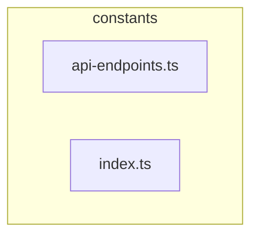

# 📌 constants

[frontend](../../../README.md) > [src](../../README.md) > [core](../README.md) > [constants](README.md)

---

### 🎯 PURPOSE
Elevating the digital experience for the Mavluda Beauty ecosystem, this module manages the sophisticated Root / Operational Layer operations.

*FSD Layer:* **Root / Operational Layer**

---

### 🏗️ ARCHITECTURE



---

### 📄 FILE REGISTRY
| File Name | Type | Responsibility | Key Aliases Used |
|-----------|------|----------------|------------------|
| `api-endpoints.ts` | Source | Handles source logic for Mavluda Beauty's luxury standards. | `@shared` |
| `index.ts` | Source | Handles source logic for Mavluda Beauty's luxury standards. | `None` |

---

### 🔗 DEPENDENCIES
**Key Path Aliases Detected:** `@shared`

Notable imports:
- `@shared/lib`
- `./api-endpoints`

---

### 🛠️ USAGE
To interact with this directory's luxurious logic, integrate its exported components or services directly into your feature modules. Ensure strict adherence to the Root / Operational Layer boundaries.

```typescript
// Example integration snippet
import { FeatureModule } from '@path/to/constants';
```
