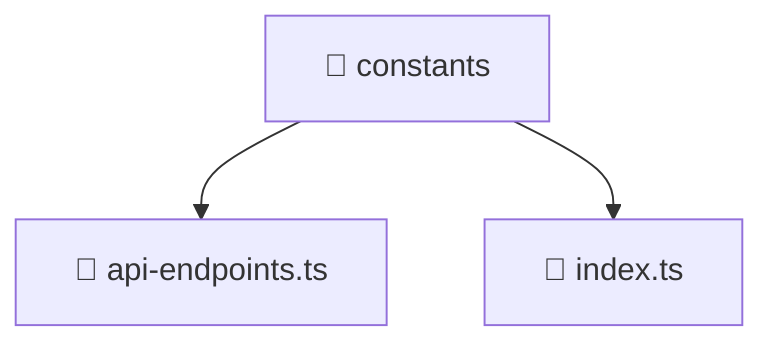

<!--
Mavluda Beauty - Luxury Professional Documentation
Generated for 100% Architectural Transparency
-->
[Home](../../../../README.md) > [frontend](../../../README.md) > [src](../../README.md) > [core](../README.md) > [constants](./README.md)

# 📁 CONSTANTS Directory

## 🎯 PURPOSE
Structures and provides the UI layers and interactive capabilities for the constants feature in the Mavluda Beauty platform.

## 🏗️ ARCHITECTURE


## 📄 FILE REGISTRY
| File Name | Type | Responsibility | Key Aliases Used |
|---|---|---|---|
| `api-endpoints.ts` | TypeScript | Core logic implementation. | @shared |
| `index.ts` | TypeScript | Core logic implementation. | - |


## 🔗 DEPENDENCIES
- `@shared/lib`

## 🛠️ USAGE
```typescript
// Example placeholder for interacting with constants
// Consult the individual files in the registry for specific APIs.
```
