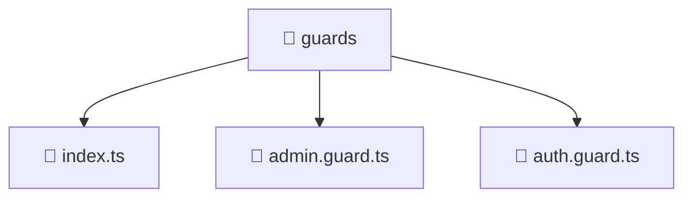

# 🏷️ Guards

[🏠 Home](../../../../README.md) ❯ [frontend](../../../README.md) ❯ [src](../../README.md) ❯ [core](../README.md) ❯ **guards**

**FSD Layer:** `App`

## 🎯 PURPOSE
Core implementation for the guards domain within the luxury Mavluda Beauty ecosystem.

## 🏗️ ARCHITECTURE

## 📄 FILE REGISTRY
| Entry Name | Type | Responsibility | Key Aliases Used |
|---|---|---|---|
| `📄 index.ts` | Logic/Utility | Structural or configuration definitions. | None |
| `📄 admin.guard.ts` | Logic/Utility | Structural or configuration definitions. | @angular/core, @entities/user, @angular/router |
| `📄 auth.guard.ts` | Logic/Utility | Structural or configuration definitions. | @angular/core, @entities/user, @angular/router |

## 🔗 DEPENDENCIES
- `@angular/core`
- `@entities/user`
- `@angular/router`

## 🛠️ USAGE
Explore the files and directories within this path to understand the refined logic that powers the Mavluda Beauty experience. Refer to the specific classes and functions outlined in the registry for implementation details.
