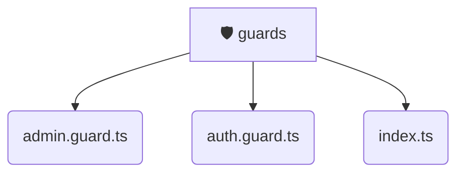

# [frontend](/frontend) / [src](/frontend/src) / [core](/frontend/src/core) / [guards](/frontend/src/core/guards)

## 🏷️ 🛡️ Guards

### 🎯 PURPOSE
The `guards` directory forms a critical foundation within the Mavluda Beauty ecosystem, meticulously orchestrating the guards logic to ensure a seamless and premium experience. Integrated within our cutting-edge Angular frontend architecture, it crafts an elegant, highly-responsive user interface reflecting our luxury brand standards.

### 🏗️ ARCHITECTURE


### 📄 FILE REGISTRY
| File Name | Type | Responsibility | Key Aliases Used |
|---|---|---|---|
| `admin.guard.ts` | `ts` | Encapsulates premium logic and definitions for `admin.guard.ts`. | @entities/user, @angular/core, @angular/router |
| `auth.guard.ts` | `ts` | Encapsulates premium logic and definitions for `auth.guard.ts`. | @entities/user, @angular/core, @angular/router |
| `index.ts` | `ts` | Encapsulates premium logic and definitions for `index.ts`. | None |


### 🔗 DEPENDENCIES
- `@angular/core`
- `@angular/router`
- `@entities/user`

### 🛠️ USAGE
```typescript
// Seamlessly integrate guards into your refined workflows:
import { /* exported members */ } from '@path/to/guards';
```
