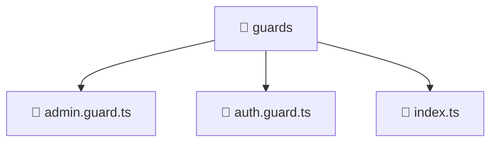

# 📁 Mavluda Beauty guards

[frontend](/frontend) / [src](/frontend/src) / [core](/frontend/src/core) / [guards](/frontend/src/core/guards)

## 🎯 Purpose
Delivering luxury-tier architectural components and high-performance logic for the **guards** domain. This directory is a crucial part of the Mavluda Beauty full-stack ecosystem, ensuring seamless scalability, robust performance, and an elite digital experience.

## 🏗️ Architecture


## 📄 File Registry
| File Name | Type | Responsibility | Key Aliases Used |
|---|---|---|---|
| `admin.guard.ts` | TypeScript Logic | Core logic and utilities for this domain. | `@angular/core, @angular/router, @entities/user` |
| `auth.guard.ts` | TypeScript Logic | Core logic and utilities for this domain. | `@angular/core, @angular/router, @entities/user` |
| `index.ts` | TypeScript Logic | Core logic and utilities for this domain. | N/A |


## 🔗 Dependencies
**Path Aliases:**
- `@angular/core`
- `@angular/router`
- `@entities/user`


## 🛠️ Usage
```typescript
// Example integration for guards
// Import capabilities from this directory to enrich your modules.
```
> This directory provides specialized logic tailored to the Mavluda Beauty standard.
