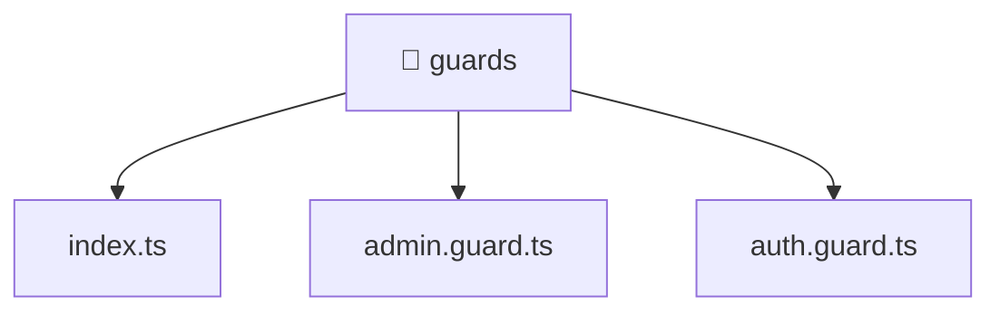

[🏠 Home](../../../../README.md) > [frontend](../../../README.md) > [src](../../README.md) > [core](../README.md) > [guards](./README.md)

# 📁 guards

### 🎯 PURPOSE
Welcome to the exquisite **guards** module of the Mavluda Beauty ecosystem. This directory handles specific domain assets and logic. It is designed adhering to our 'Luxury Professional' standards.

### 🏗️ ARCHITECTURE


### 📄 FILE REGISTRY
| File Name | Type | Responsibility | Key Aliases Used |
|---|---|---|---|
| `admin.guard.ts` | TypeScript File | Provides logic and definitions for admin.guard.ts. | @entities, @angular |
| `auth.guard.ts` | TypeScript File | Provides logic and definitions for auth.guard.ts. | @entities, @angular |
| `index.ts` | TypeScript File | Exports or orchestrates module members. | None |

### 🔗 DEPENDENCIES
- `@angular/core`
- `@angular/router`
- `@entities/user`

### 🛠️ USAGE
```typescript
// Example interaction or integration snippet
// Import members from guards based on module boundaries
```
