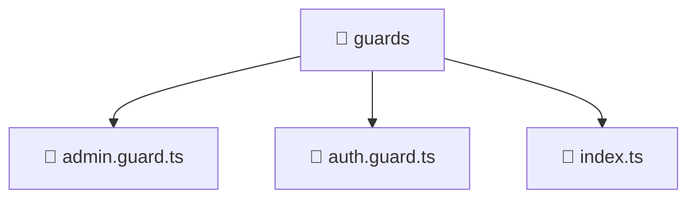

### 🧭 Breadcrumbs
[Root](/) > [frontend](/frontend) > [src](/frontend/src) > [core](/frontend/src/core) > [guards](/frontend/src/core/guards)

# 📁 Guards Directory
**Architecture Layer:** Domain/Infrastructure Layer

## 🎯 Purpose
Provides luxury professional architectural implementation for the guards module within the Mavluda Beauty ecosystem. Ensure robust functionality and elegant integration with the broader architecture.

## 🏗️ ARCHITECTURE


## 📄 FILE REGISTRY
| File Name | Type | Responsibility | Key Aliases Used |
|---|---|---|---|
| `admin.guard.ts` | TypeScript | Provides core logic and orchestration for admin.guard.ts. | @angular/core, @entities/user, @angular/router |
| `auth.guard.ts` | TypeScript | Provides core logic and orchestration for auth.guard.ts. | @angular/core, @entities/user, @angular/router |
| `index.ts` | TypeScript | Provides core logic and orchestration for index.ts. | N/A |

## 🔗 DEPENDENCIES
- `@angular/core`
- `@angular/router`
- `@entities/user`

## 🛠️ USAGE
```typescript
// Example architectural integration for guards
// Utilize the exported members according to Mavluda Beauty's standard conventions.
```

---
*Maintained by Mavluda Beauty - Architecture & Engineering*

---
*Maintained by Mavluda Beauty - Architecture & Engineering*