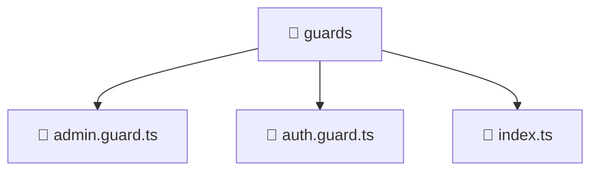

<!--
Mavluda Beauty - Luxury Professional Documentation
Generated for 100% Architectural Transparency
-->
[Home](../../../../README.md) > [frontend](../../../README.md) > [src](../../README.md) > [core](../README.md) > [guards](./README.md)

# 📁 GUARDS Directory

## 🎯 PURPOSE
Structures and provides the UI layers and interactive capabilities for the guards feature in the Mavluda Beauty platform.

## 🏗️ ARCHITECTURE


## 📄 FILE REGISTRY
| File Name | Type | Responsibility | Key Aliases Used |
|---|---|---|---|
| `admin.guard.ts` | TypeScript | Route protection and authorization logic. | @angular, @entities |
| `auth.guard.ts` | TypeScript | Route protection and authorization logic. | @angular, @entities |
| `index.ts` | TypeScript | Core logic implementation. | - |


## 🔗 DEPENDENCIES
- `@angular/core`
- `@angular/router`
- `@entities/user`

## 🛠️ USAGE
```typescript
// Example placeholder for interacting with guards
// Consult the individual files in the registry for specific APIs.
```
