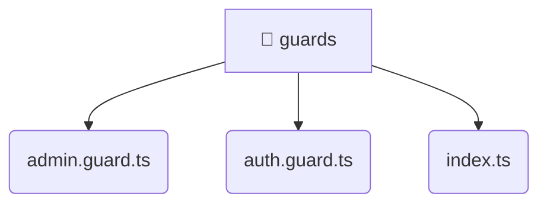

# [root](/) / [frontend](/frontend) / [src](/frontend/src) / [core](/frontend/src/core) / [guards](/frontend/src/core/guards)

## 🏷️ 📁 Guards

### 🎯 PURPOSE
The `guards` directory handles frontend architecture and configuration for the Mavluda Beauty platform.

### 🏗️ ARCHITECTURE


### 📄 FILE REGISTRY
| File Name | Type | Responsibility | Key Aliases Used |
|---|---|---|---|
| `admin.guard.ts` | `ts` | Core logic implementation. | @angular, @entities |
| `auth.guard.ts` | `ts` | Core logic implementation. | @angular, @entities |
| `index.ts` | `ts` | Core logic implementation. | None |

### 🔗 DEPENDENCIES
- `./admin.guard`
- `./auth.guard`
- `@angular/core`
- `@angular/router`
- `@entities/user`

### 🛠️ USAGE
```typescript
// Seamlessly integrate guards into your refined workflows:
import { /* exported members */ } from '@path/to/guards';
```
