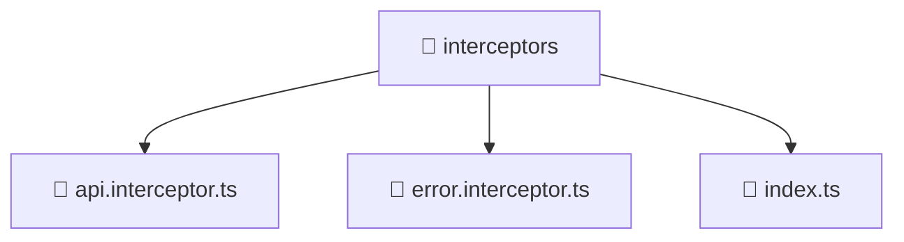

# 📁 interceptors

[Root](/.) > [frontend](/frontend) > [src](/frontend/src) > [core](/frontend/src/core) > [interceptors](/frontend/src/core/interceptors)

## 🎯 Purpose
Delivering luxury-tier architectural components and high-performance logic for the **interceptors** domain. This directory is a crucial part of the Mavluda Beauty full-stack ecosystem, ensuring seamless scalability, robust performance, and an elite digital experience.

## 🏗️ Architecture


## 📄 File Registry
| File Name | Type | Responsibility | Key Aliases Used |
|---|---|---|---|
| `api.interceptor.ts` | TypeScript | Handles logic and definitions for api.interceptor.ts | @angular/common/http, @shared/lib |
| `error.interceptor.ts` | TypeScript | Handles logic and definitions for error.interceptor.ts | @angular/common/http, @angular/core, @shared/services |
| `index.ts` | TypeScript | Handles logic and definitions for index.ts | None |

## 🔗 Dependencies
- `@angular/common/http`
- `@angular/core`
- `@shared/lib`
- `@shared/services`
- `rxjs`

## 🛠️ Usage
```typescript
// Example usage within the Mavluda Beauty ecosystem
import { relevantMember } from './interceptors';

// Integrate into the application architecture
relevantMember.execute();
```
