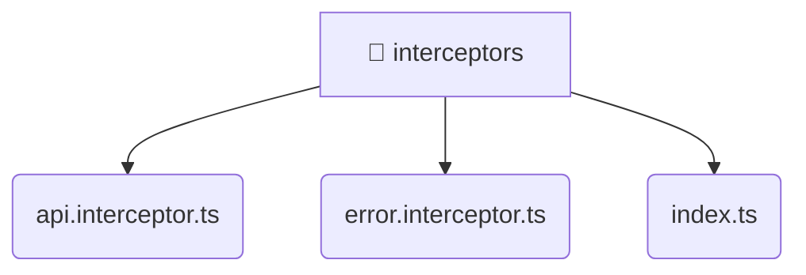

# [root](/) / [frontend](/frontend) / [src](/frontend/src) / [core](/frontend/src/core) / [interceptors](/frontend/src/core/interceptors)

## 🏷️ 📁 Interceptors

### 🎯 PURPOSE
The `interceptors` directory handles frontend architecture and configuration for the Mavluda Beauty platform.

### 🏗️ ARCHITECTURE


### 📄 FILE REGISTRY
| File Name | Type | Responsibility | Key Aliases Used |
|---|---|---|---|
| `api.interceptor.ts` | `ts` | Core logic implementation. | @angular, @shared |
| `error.interceptor.ts` | `ts` | Core logic implementation. | @angular, @shared |
| `index.ts` | `ts` | Core logic implementation. | None |

### 🔗 DEPENDENCIES
- `./api.interceptor`
- `./error.interceptor`
- `@angular/common/http`
- `@angular/core`
- `@shared/lib`
- `@shared/services`
- `rxjs`

### 🛠️ USAGE
```typescript
// Seamlessly integrate interceptors into your refined workflows:
import { /* exported members */ } from '@path/to/interceptors';
```
