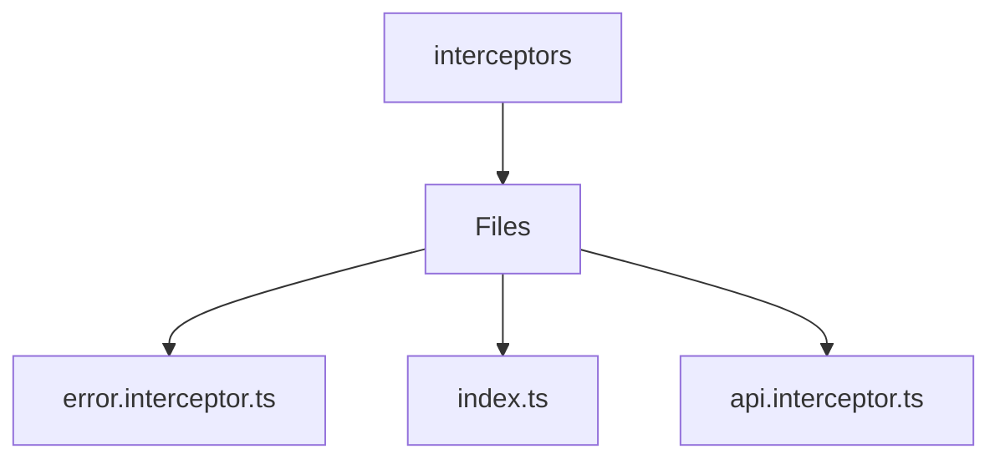

# 🏷️ Interceptors Directory

> *Elegance, Precision, and Luxury Professionalism — The Mavluda Beauty Standard.*

## 🧭 Breadcrumb Navigation
[frontend](/frontend) ➔ [src](/frontend/src) ➔ [core](/frontend/src/core) ➔ [interceptors](/frontend/src/core/interceptors)

## 🎯 Purpose
This directory encapsulates the essential architecture and logic for the **Interceptors** domain within the Mavluda Beauty ecosystem. It serves as a foundational component ensuring robust, scalable, and elegant operations.

## 🏗️ Architecture


## 📄 File Registry
| File Name | Type | Responsibility | Key Aliases Used |
|---|---|---|---|
| `error.interceptor.ts` | TypeScript | Exports: errorInterceptor | @shared |
| `index.ts` | TypeScript | Defines logic and structure for index.ts. | None |
| `api.interceptor.ts` | TypeScript | Exports: apiInterceptor | @shared |

## 🔗 Dependencies
- `@angular/common/http`
- `@angular/core`
- `@shared/lib`
- `@shared/services`
- `rxjs`

## 🛠️ Usage
```typescript
// To utilize the luxurious capabilities of this module:
import { errorInterceptor } from './path/to/errorinterceptor';

// Ensure properly typed interactions per Mavluda Beauty standards
```
