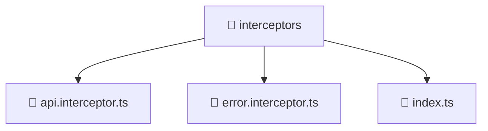

# 📁 interceptors

[Root](/../../../../README.md) / [frontend](../../../README.md) / [src](../../README.md) / [core](../README.md) / [interceptors](./README.md)

## 🎯 Purpose
Delivering luxury-tier architectural components and high-performance logic for the **interceptors** domain. This directory is a crucial part of the Mavluda Beauty full-stack ecosystem, ensuring seamless scalability, robust performance, and an elite digital experience.

## 🏗️ Architecture


## 📄 File Registry
| File Name | Type | Responsibility | Key Aliases Used |
|---|---|---|---|
| `api.interceptor.ts` | Interceptor | Provides core logic and orchestration for api.interceptor.ts. | @angular, @shared |
| `error.interceptor.ts` | Interceptor | Provides core logic and orchestration for error.interceptor.ts. | @angular, @shared |
| `index.ts` | TypeScript | Provides core logic and orchestration for index.ts. | N/A |


## 🔗 Dependencies
**Internal / Aliases:**
- `@angular/common/http`
- `@angular/core`
- `@shared/lib`
- `@shared/services`

**External:**
- `rxjs`


## 🛠️ Usage
```typescript
// Example usage within the Mavluda Beauty ecosystem
import { relevantMember } from './api.interceptor';

// Integrate into the application architecture
relevantMember.execute();
```
