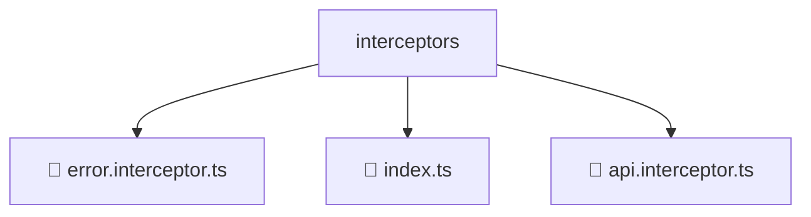

# 📂 INTERCEPTORS

> 💎 **Mavluda Beauty - Luxury Professional Architecture**

### 📍 Breadcrumb Navigation
`. > frontend > src > core > interceptors`

## 🎯 PURPOSE
This directory encapsulates `General` level functionality within the Mavluda Beauty ecosystem, ensuring proper separation of concerns and architectural transparency.

**FSD / Architecture Layer:** `General`

## 🏗️ ARCHITECTURE


## 📄 FILE REGISTRY

| Item Name | Type | Responsibility | Key Aliases Used |
|-----------|------|----------------|------------------|
| `📄 error.interceptor.ts` | `.ts` | General functionality | `@angular/core, @shared/services, @angular/common/http` |
| `📄 index.ts` | `.ts` | General functionality | `None` |
| `📄 api.interceptor.ts` | `.ts` | General functionality | `@shared/lib, @angular/common/http` |

## 🔗 DEPENDENCIES
- `@shared/lib`
- `@angular/core`
- `@angular/common/http`
- `@shared/services`

## 🛠️ USAGE
```typescript
// Example usage context
import { ... } from './error.interceptor';

// Integrate error.interceptor logic into your feature.
```
