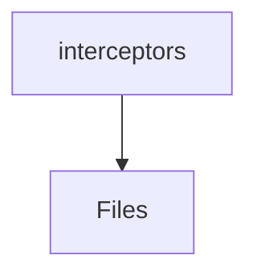

# 📁 Interceptors Directory

[frontend](/frontend) > [src](/frontend/src) > [core](/frontend/src/core) > [interceptors](/frontend/src/core/interceptors)

## 🎯 Purpose
A high-level module handling `interceptors` logic within the Mavluda Beauty ecosystem. This directory adheres to our "Luxury Professional" architectural standards.


## 🏗️ Architecture



## 📄 File Registry
| File Name | Type | Responsibility | Key Aliases Used |
|-----------|------|----------------|------------------|
| `api.interceptor.ts` | TypeScript | Intercepts HTTP requests/responses for global logic. | @angular/common/http, @shared/lib |
| `error.interceptor.ts` | TypeScript | Intercepts HTTP requests/responses for global logic. | @shared/services, @angular/common/http, @angular/core |
| `index.ts` | TypeScript | Provides localized typescript definitions. | None |

## 🔗 Dependencies
- `@angular/common/http`
- `@angular/core`
- `@shared/lib`
- `@shared/services`

## 🛠️ Usage
```typescript
// Architectural overview snippet
import { InternalLogic } from './internal-file';
// Ensure adherence to Hexagonal / FSD principles
```
