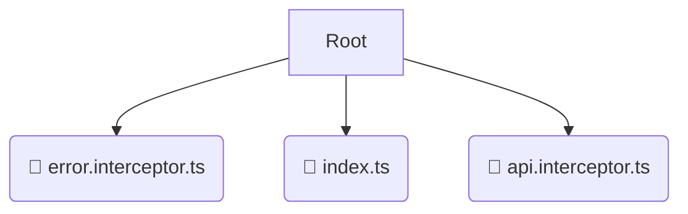

# 📂 interceptors

*Breadcrumbs:* [frontend](/frontend) / [src](/frontend/src) / [core](/frontend/src/core) / [interceptors](/frontend/src/core/interceptors)

## 🎯 PURPOSE
This directory `interceptors` is an integral part of the Mavluda Beauty ecosystem. It contributes to the Angular zoneless, signal-based frontend.
This directory is meticulously maintained to uphold the 'Luxury Professional' standards of the Mavluda Beauty brand.

## 🏗️ ARCHITECTURE


## 📄 FILE REGISTRY
| File Name | Type | Responsibility | Key Aliases Used |
|---|---|---|---|
| `error.interceptor.ts` | `ts` | Core functionality | `@angular/core, @angular/common/http, @shared/services` |
| `index.ts` | `ts` | Core functionality | `None` |
| `api.interceptor.ts` | `ts` | Core functionality | `@angular/common/http, @shared/lib` |

## 🔗 DEPENDENCIES
- `@angular/core`
- `@angular/common/http`
- `@shared/services`
- `@shared/lib`

## 🛠️ USAGE
```typescript
// Example placeholder for interacting with the interceptors module
import { example } from './error.interceptor.ts';
```
