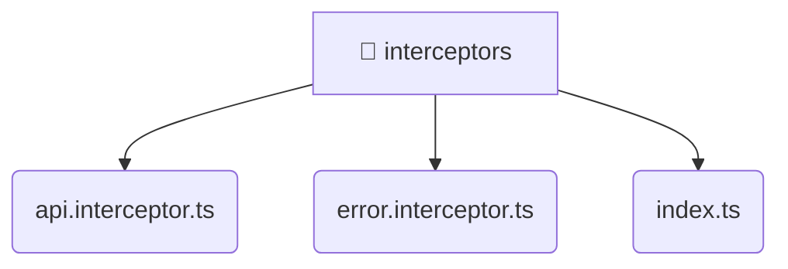

# [frontend](/frontend) / [src](/frontend/src) / [core](/frontend/src/core) / [interceptors](/frontend/src/core/interceptors)

## 🏷️ 📁 Interceptors

### 🎯 PURPOSE
The `interceptors` directory forms a critical foundation within the Mavluda Beauty ecosystem, meticulously orchestrating the interceptors logic to ensure a seamless and premium experience. Integrated within our cutting-edge Angular frontend architecture, it crafts an elegant, highly-responsive user interface reflecting our luxury brand standards.

### 🏗️ ARCHITECTURE


### 📄 FILE REGISTRY
| File Name | Type | Responsibility | Key Aliases Used |
|---|---|---|---|
| `api.interceptor.ts` | `ts` | Encapsulates premium logic and definitions for `api.interceptor.ts`. | @shared/lib, @angular/common/http |
| `error.interceptor.ts` | `ts` | Encapsulates premium logic and definitions for `error.interceptor.ts`. | @angular/core, @shared/services, @angular/common/http |
| `index.ts` | `ts` | Encapsulates premium logic and definitions for `index.ts`. | None |


### 🔗 DEPENDENCIES
- `@angular/common/http`
- `@angular/core`
- `@shared/lib`
- `@shared/services`

### 🛠️ USAGE
```typescript
// Seamlessly integrate interceptors into your refined workflows:
import { /* exported members */ } from '@path/to/interceptors';
```
